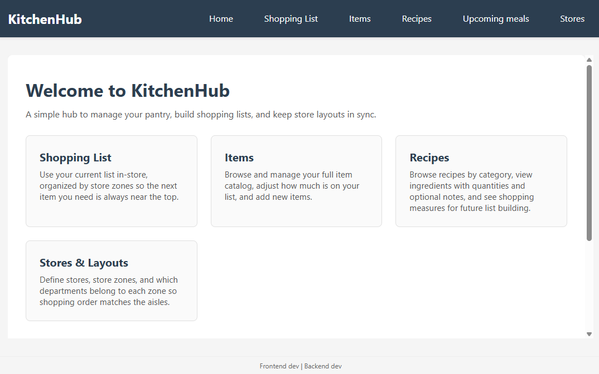
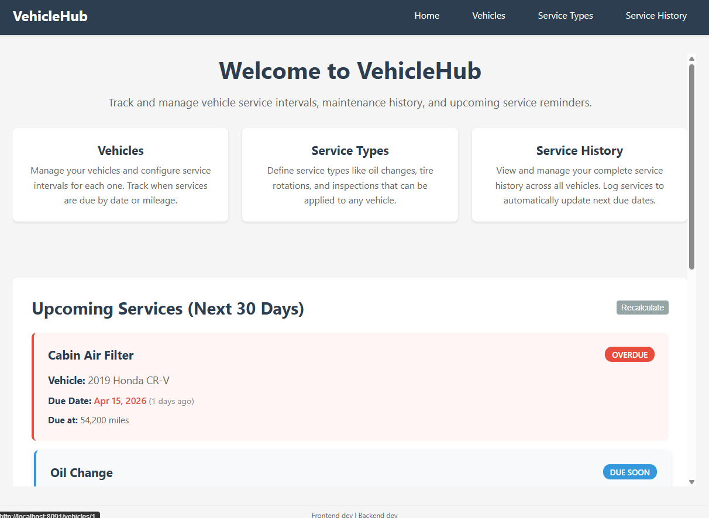
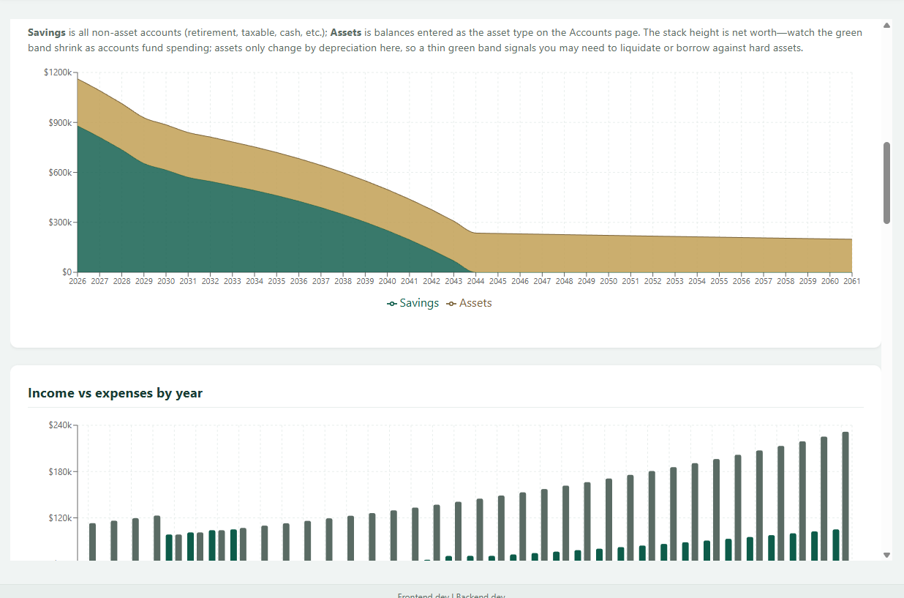
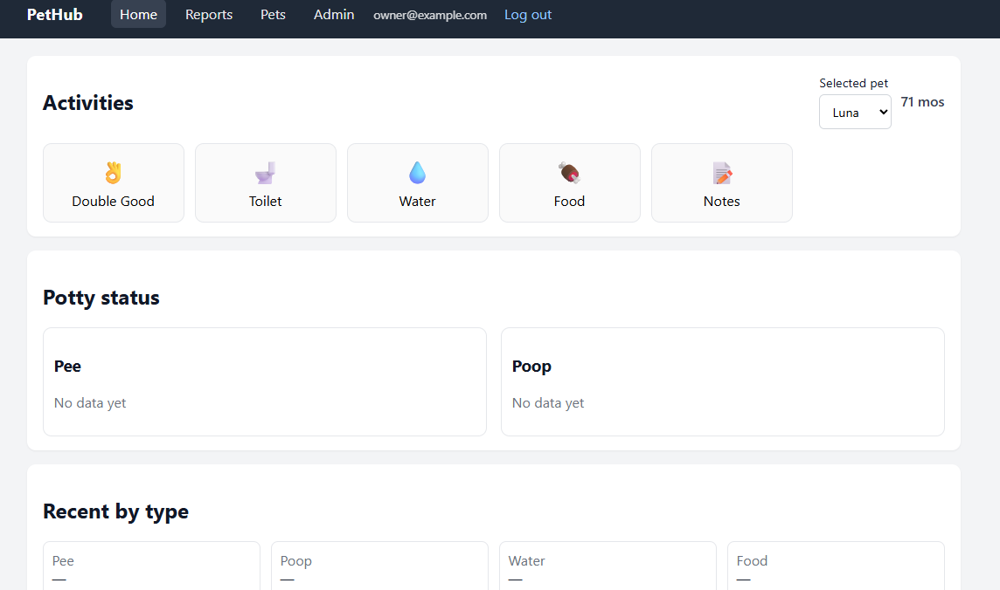

# Self-Hosted Web Apps

A monorepo of self-hosted web applications. **KitchenHub**, **VehicleHub**, and **RetirementHub** each ship a Node.js + Express REST API, a React + Vite SPA, PostgreSQL, and Docker-friendly layouts. **PetHub** is the same React + Vite and PostgreSQL pattern, but its API is Python + Flask (Gunicorn in the published backend image). **MailHub** is a separate multi-container mail stack (see [MailHub README](mailhub/README.md)).

## Preview

Screenshots use demo-style data. Click a thumbnail to open that hub’s README.

| [KitchenHub](kitchenhub/README.md) | [VehicleHub](vehiclehub/README.md) | [RetirementHub](retirementhub/README.md) | [PetHub](pethub/README.md) |
| :---: | :---: | :---: | :---: |
| <a href="kitchenhub/README.md"></a> | <a href="vehiclehub/README.md"></a> | <a href="retirementhub/README.md"></a> | <a href="pethub/README.md"></a> |

**[MailHub](mailhub/README.md)** — SMTP, filtering, and IMAP/LMTP stack (no app UI screenshots in this repo).

## Overview

Each app has its own API, UI, and database schema. They are intended to run on a Docker host with a reverse proxy and TLS in front (details are up to your environment).

## Pre-built Docker images

Hub images are **public** on Docker Hub: [derpmhichurp repositories](https://hub.docker.com/repositories/derpmhichurp). You can deploy with each service’s `portainer-stack.yml` without building locally.

| Service | Backend image | Frontend image |
|---------|---------------|----------------|
| KitchenHub | `derpmhichurp/kitchenhub-backend` | `derpmhichurp/kitchenhub-frontend` |
| VehicleHub | `derpmhichurp/vehiclehub-backend` | `derpmhichurp/vehiclehub-frontend` |
| RetirementHub | `derpmhichurp/retirementhub-backend` | `derpmhichurp/retirementhub-frontend` |
| PetHub | `derpmhichurp/pethub-backend` | `derpmhichurp/pethub-frontend` |
| MailHub | `derpmhichurp/mailhub-postfix`, `mailhub-amavisd`, `mailhub-dovecot` | — |

```bash
docker pull derpmhichurp/kitchenhub-backend:latest
docker pull derpmhichurp/kitchenhub-frontend:latest
```

Tags follow the same convention as CI: `latest` (stable release on `main`), `beta` (pre-release from other branches), or a pinned semver (e.g. `1.2.3`). See each hub’s `DEPLOYMENT.md` where present, or `portainer-stack.yml` + GitHub Actions at the repo root.

## Services

- **KitchenHub** — Shopping lists with optional store layout ordering, recipes, and related data
- **VehicleHub** — Vehicle maintenance and service history
- **RetirementHub** — Retirement-oriented budgeting, savings limits, and projections
- **MailHub** — Multi-container mail stack (SMTP, filtering, IMAP/LMTP). Different layout than the other hubs
- **PetHub** — Pet activity tracking (ports backend `8120`, frontend `8130`)

## Architecture (KitchenHub, VehicleHub, RetirementHub, PetHub)

- **Backend**: Node.js + Express (KitchenHub, VehicleHub, RetirementHub); Python + Flask (PetHub), with Gunicorn as the WSGI server in its Docker image  
- **Frontend**: React + Vite for KitchenHub, VehicleHub, RetirementHub, and PetHub (often served by nginx in production)  
- **Database**: PostgreSQL  
- **Deployment**: Docker / Compose (see each service)

### Port allocation (local dev)

Default ports are spaced to avoid clashes:

- **KitchenHub**: backend `8080`, frontend `8081`
- **VehicleHub**: backend `8090`, frontend `8091`
- **RetirementHub**: backend `8100`, frontend `8110`
- **PetHub**: backend `8120`, frontend `8130`
- Future services: continue the pattern (e.g. +10 per service)

## Deployment (high level)

Typical setup:

1. **Host** — Linux with Docker (or similar) and persistent volumes for databases and app data  
2. **Database** — PostgreSQL (container or external)  
3. **Edge** — A reverse proxy terminating TLS and routing hostnames to the right containers (Caddy, nginx, Traefik, HAProxy, etc.)  
4. **DNS / certificates** — Whatever you use for names and ACME (router, separate DNS, internal DNS, etc.)

Each service directory includes `docker-compose.yml`, optional `portainer-stack.yml`, `env.example`, and a `README.md` with concrete steps.

### Local deploy (sketch)

1. `cd <service>`  
2. `cp env.example .env` and set database (and other) variables  
3. Apply `database/schema.sql` (and migrations if upgrading) with `psql`  
4. **Option A — pull pre-built images:** deploy `portainer-stack.yml` with `DOCKER_HUB_REGISTRY_USERNAME=derpmhichurp` and `IMAGE_TAG=latest` (or a pinned version)  
5. **Option B — build locally:** `docker compose up -d --build`  
6. Point your proxy at the published ports and add DNS names as needed  

Backends expose `/api/health` for readiness checks.

## Project structure

```
.
├── common/              # Shared code
│   ├── database/
│   └── api/
├── kitchenhub/
├── vehiclehub/
├── retirementhub/
├── mailhub/
├── pethub/
└── README.md
```

## Development

- [KitchenHub README](kitchenhub/README.md)  
- [VehicleHub README](vehiclehub/README.md)  
- [RetirementHub README](retirementhub/README.md)  
- [MailHub README](mailhub/README.md)  
- [PetHub README](pethub/README.md)

## Demo data

The repo includes reusable seed scripts for screenshot/demo environments:

- `kitchenhub/database/demo-seed.sql`
- `vehiclehub/database/demo-seed.sql`
- `retirementhub/database/demo-seed.sql`
- `pethub/database/demo-seed.sql`

Run these from the repo root to apply demo data to the hosted demo databases:

```powershell
$env:PGPASSWORD="<db-password>"
```

```powershell
docker run --rm -v "${PWD}:/workspace" -e PGPASSWORD="$env:PGPASSWORD" postgres:16 psql -h <db-host> -p 5432 -U <db-user> -d demo_kitchenhub -f /workspace/kitchenhub/database/demo-seed.sql
docker run --rm -v "${PWD}:/workspace" -e PGPASSWORD="$env:PGPASSWORD" postgres:16 psql -h <db-host> -p 5432 -U <db-user> -d demo_vehiclehub -f /workspace/vehiclehub/database/demo-seed.sql
docker run --rm -v "${PWD}:/workspace" -e PGPASSWORD="$env:PGPASSWORD" postgres:16 psql -h <db-host> -p 5432 -U <db-user> -d demo_retirementhub -f /workspace/retirementhub/database/demo-seed.sql
docker run --rm -v "${PWD}:/workspace" -e PGPASSWORD="$env:PGPASSWORD" postgres:16 psql -h <db-host> -p 5432 -U <db-user> -d demo_pethub -f /workspace/pethub/database/demo-seed.sql
```

Notes:
- The seed scripts are idempotent and safe to rerun.
- Apply each service schema once before seeding a fresh database:
  - `kitchenhub/database/schema.sql`
  - `vehiclehub/database/schema.sql`
  - `retirementhub/database/schema.sql`
  - `pethub/database/schema.sql`

## Shared code

`common/database/db-config.js` — PostgreSQL pool  
`common/api/api-client.js` — API client reference for frontends  

Backends import from `common` via relative paths, for example:

```javascript
const { createDbPool } = require('../../common/database/db-config');
```

## Security notes

- Run services behind TLS at the edge; do not commit real `.env` files or secrets  
- Restrict database access to application containers on internal networks  
- For MailHub, keep credentials in env or mounted secrets, not in public docs  

## License

[Add your license here]
