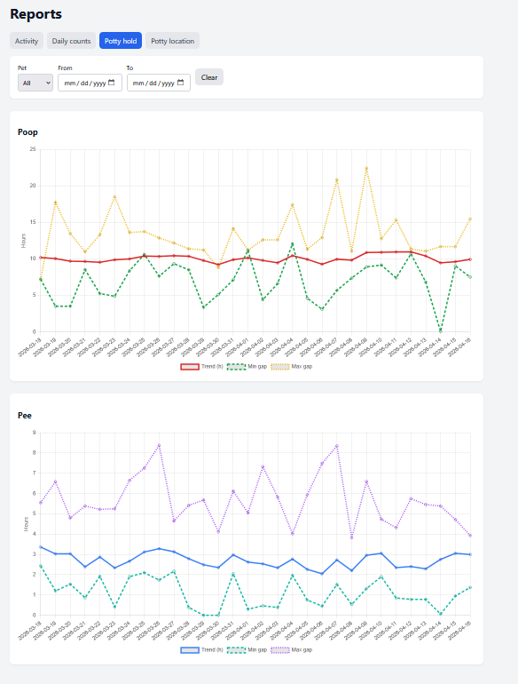
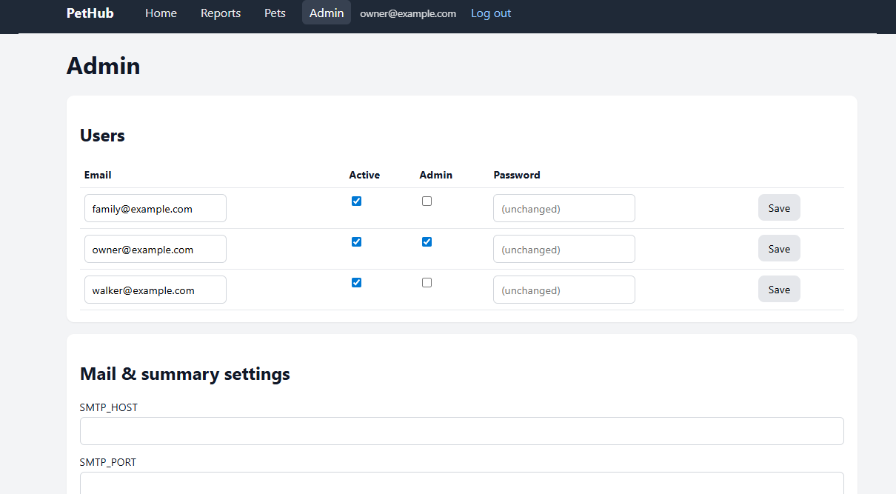

# PetHub

Pet activity tracking (toilet visits, water, reports, multi-user pets). Migrated from the standalone PetDB Flask project into this monorepo and renamed to PetHub.

## Screenshots






## Stack

| Layer | Technology |
|--------|------------|
| Backend | Python 3.13, Flask, SQLAlchemy 2, Alembic, Gunicorn |
| Data | PostgreSQL |
| Frontend | React 18 + Vite, nginx serves the built SPA and proxies `/api/*` to Flask |

The hub layout matches other services: `backend/`, `frontend/`, `database/`, `docker-compose.yml`, `portainer-stack.yml`, and `env.example`.

### Pre-built images

Public images on Docker Hub: [derpmhichurp](https://hub.docker.com/repositories/derpmhichurp) — `derpmhichurp/pethub-backend`, `derpmhichurp/pethub-frontend`. See [DEPLOYMENT.md](DEPLOYMENT.md) and [portainer-stack.yml](portainer-stack.yml).

Ports follow the monorepo convention after RetirementHub (8100/8110): **backend 8120**, **frontend 8130** (host maps to container port 80).

### HAProxy / health checks

- **Frontend (nginx)**: use `GET /healthz` — returns `200` with body `ok` and does not hit Flask or the SPA.
- **Backend (Flask)**: use `GET /api/health` — returns `200` JSON (`status`, `timestamp`, `version`); no DB and no login.

**`use_backend` order:** HAProxy applies the **first matching** `use_backend`. If you have both “whole site” and “API only” backends, put the **API** rule **before** the generic host rule, otherwise every request (including `/api/...`) hits the frontend line first and the API line is never used (usually still OK because nginx proxies `/api/`, but wrong ordering plus a bad nginx/upstream config is harder to debug).

```text
# Recommended: API first, then SPA
use_backend pethub_backend_api if host_pethub path_beg /api
use_backend pethub_frontend if host_pethub
```

Example backends:

```text
backend pethub_frontend
    option httpchk GET /healthz
    http-check expect status 200
    server pethub-frontend pethub-frontend:80 check

backend pethub_backend_api
    option httpchk GET /api/health
    http-check expect status 200
    server pethub-backend pethub-backend:80 check
```

**If the SPA shows axios “404”:** In DevTools → Network, open the failing request. Confirm **Request URL** is `https://<your-host>/api/...` (same host as the UI). If the **response body** is HTML (e.g. another app’s 404 page), the request is hitting the **wrong backend** in HAProxy (fix ACLs / default backend). If the body is JSON from Flask, it’s a real “not found” from the API.

**Shared `edge` network (recommended with HAProxy):** On the host once: `docker network create edge`. Hub `portainer-stack.yml` files attach **`pethub-backend`**, **`kitchenhub-backend`**, etc. as **aliases** on both the stack’s internal network and **`edge`**. nginx proxies to **`http://pethub-backend:80`** (unique name). Deploy HAProxy as its **own** Portainer stack that **only** joins `edge` (see repo root **`edge-network/haproxy-stack.example.yml`**): no `docker network connect` scripts—declare `networks: { edge: { external: true } }` in the HAProxy compose. In HAProxy, use server names **`pethub-frontend`**, **`pethub-backend`**, **`kitchenhub-frontend`**, … on port 80.

**Local `docker compose`:** Only the internal network is defined (no `edge`); aliases still make **`pethub-backend`** resolve inside the stack. Portainer deploys need the **`edge`** network created first or stack deploy will fail on missing external network.

## Local development

From `pethub/`:

1. Copy `env.example` to `.env` and set `SECRET_KEY`, database credentials, and optional SMTP variables.
2. Ensure PostgreSQL is reachable (local instance or existing server).
3. Run the stack:

```bash
docker compose up --build
```

Open **http://localhost:8130**. The UI is the React SPA; JSON APIs live under `/api` on the same origin (proxied to Flask).

### Frontend only (Vite dev server)

From `pethub/frontend` after `npm install`:

```bash
npm run dev
```

Vite listens on **port 3002** and proxies `/api` to `http://localhost:8120` (override with `VITE_API_PROXY_TARGET`). Set `CORS_ORIGINS` on the backend to include `http://localhost:3002` (see `env.example`) so session cookies work when testing cross-origin.

**Offline activity queue:** Home activity saves use the same `localStorage` key as the legacy app (`pending_activities_v1`). If you are offline or the quick POST times out (~1.5s), the payload is queued and flushed when you are back online and signed in. The header shows pending count and an “Offline” badge; closing the tab while offline with pending items triggers the usual beforeunload warning.

For Flask’s dev server without Docker, from `pethub/backend` with a virtualenv and `pip install -r requirements.txt`:

```bash
set PORT=8120
python app.py
```

## Database

- **Alembic** migrations live under `pethub/backend/alembic/`. The container entrypoint runs `alembic upgrade head` when `DATABASE_URL` is set or when `DB_HOST` is set (URL is built like `db.py`).
- **`database/schema.sql`** is a reference snapshot for greenfield installs; existing databases created as `petdb` can keep the same `DB_NAME` and Alembic history.

## CI and releases

GitHub Actions builds `pethub-backend` and `pethub-frontend` images on pull requests (no push) and on tags `pethub/X.Y.Z`, same semver rules as other hubs.

### Portainer: deploy returns HTTP 500

The stack file is normal Compose; a generic **500** comes from **Portainer’s API** when the engine rejects the deploy. Typical causes:

1. **Wrong stack type in Portainer** — These files target **Docker Standalone** with **`docker compose`** (in Portainer: a **Compose** stack on a normal Docker endpoint, not a **Swarm** stack on a swarm cluster). On Compose, `container_name`, `depends_on`, and `restart` are all valid. **`docker stack deploy` / Swarm stacks** reject `container_name` and `depends_on`, which often surfaces as a failed deploy or HTTP 500. If you are not using Swarm, ensure the environment is **Docker** (standalone) and you are not forcing a Swarm-type stack deploy.

2. **Invalid image after env substitution** — `image` must not start with `/`. Set **`DOCKER_HUB_REGISTRY_USERNAME`** (e.g. `myuser`) in the stack environment so the image is `myuser/pethub-backend:tag`, not `/pethub-backend:tag`.

3. **Engine error** — On the Portainer host: `docker logs portainer` (or `portainer-ce`) around the deploy time, or use **Portainer → Host → Events** / Docker CLI to see the real message (invalid reference, pull denied, etc.).

## Legacy Jinja UI

The Flask app still contains Jinja templates and `/auth` form routes for backwards compatibility; production traffic through nginx uses the React build. You can remove the template stack once you no longer need server-rendered pages.
